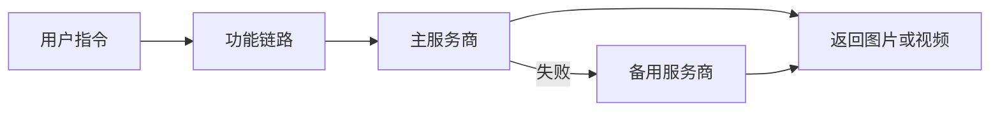

<p align="center">
  
</p>

<h1 align="center">AI绘图站</h1>

<p align="center">
  面向 AstrBot 的多服务商 AI 绘图工作台：文生图、改图、视频、批量任务与多人设自拍，一处配置即可使用。
</p>

<p align="center">
  <a href="https://github.com/Justice-ocr/astrbot_plugin_aiimg_enhanced">
    
  </a>
  
  
  
</p>


## 能做什么

| 能力 | 使用方式 | 说明 |
| --- | --- | --- |
| 文生图 | `/aiimg 一只窗边的橘猫 1:1` | 支持多服务商链路与失败自动兜底 |
| 改图 | 发送图片并输入 `/aiedit 改成水彩画` | 支持单图、多图和预设指令 |
| 人设自拍 | `/自拍 海边的傍晚` | 每套人设拥有独立描述与参考图组 |
| 批量任务 | `/批量4 aiimg 四季主题海报` | 并发生成，支持 LLM 规划差异化提示词 |
| 视频生成 | `/视频 云海中的列车` | 支持异步任务和首尾帧能力 |
| LLM 工具 | 在 AstrBot 中启用对应工具 | 让模型自动判断生图、改图或自拍模式 |

支持 OpenAI Images、Gemini、Gitee AI、Grok、Flow2API、Vertex AI、魔搭、即梦等多类接口。不同服务商可组合为主用与备用链路。

## 五分钟上手

### 1. 安装插件

在 AstrBot 插件市场搜索 **AI绘图站**，或使用仓库地址安装：

```text
https://github.com/Justice-ocr/astrbot_plugin_aiimg_enhanced
```

要求：

- AstrBot `>=4.16.0,<5`
- Python 依赖会随插件安装
- 当前元数据标记的已验证平台为 `aiocqhttp`

### 2. 添加服务商

打开 `AstrBot WebUI -> 插件 -> AI绘图站 -> 插件页面`，进入 **服务商**：

1. 点击 **新建服务商**。
2. 选择服务商类型。
3. 填写服务商 ID、API 地址、API Key 和模型名。
4. 保存服务商。

服务商 ID 是链路和临时指定服务商时使用的短名称，例如 `openai`、`gemini`。

### 3. 配置功能链路

进入 **功能开关**，把刚创建的服务商加入文生图、改图、自拍或视频链路，然后点击左下角 **保存更改**。



建议第一次只配置一个文生图服务商。确认 `/aiimg` 可用后，再增加改图、自拍和视频链路。

### 4. 发送第一条指令

```text
/aiimg 一只坐在窗边的橘猫，柔和晨光，细腻插画 1:1
```

需要临时绕过默认链路时，可直接指定服务商：

```text
/aiimg @openai 未来城市的雨夜
```

可用 `/服务商` 查看服务商状态，使用 `/链路` 查看当前功能链路。

## 人设与参考图

进入 **人设管理** 后：

1. 点击 **新建人设**。
2. 填写人设 ID、显示名称和人物描述。
3. 上传 JPG、PNG、WebP 或 GIF 参考图，单张不超过 20 MB。
4. 保存人设，再点击页面左下角 **保存更改**。
5. 在聊天中发送 `/人设`，使用 `/切换人设 名称` 切换。

参考图按原比例预览，并通过插件接口按需加载；页面同时最多加载 5 张，避免大量参考图阻塞配置初始化。

> 参考图中的稳定特征应清晰可见。建议使用光线自然、无遮挡、主体明确的图片，不要混用外观差异过大的角色。

## 配置页面

| 页面 | 主要内容 |
| --- | --- |
| 功能开关 | 功能启停、默认尺寸、批量并发、服务商链路 |
| 服务商 | 新建、编辑、删除服务商，按类型显示专用字段 |
| 预设指令 | 管理文生图、改图与视频预设 |
| 人设管理 | 管理人物描述、参考图组与当前启用人设 |
| 状态文案 | 自定义等待、完成和失败文案 |
| 高级配置 | 防抖、缓存、网络安全与兼容选项 |

配置保存后会立即刷新插件运行状态，通常无需重启 AstrBot。

## 常用指令

| 指令 | 说明 |
| --- | --- |
| `/aiimg <提示词>` | 文生图；别名：`/生图`、`/画图`、`/绘图`、`/出图` |
| `/文生图 <提示词>` | 文生图及文生图预设入口 |
| `/aiedit <提示词>` | 改图；别名：`/改图`、`/图生图`、`/修图` |
| `/<预设名> [补充提示词]` | 调用自定义改图预设 |
| `/自拍 [提示词]` | 使用当前人设和参考图生成自拍 |
| `/自拍参考 查看` | 查看命令方式设置的自拍参考图 |
| `/视频 <提示词>` | 生成视频 |
| `/批量N <模式> <提示词>` | 批量生成，例如 `/批量4 aiimg 四季街景` |
| `/人设` | 查看人设列表 |
| `/切换人设 <序号/ID/名称>` | 切换当前人设 |
| `/服务商` | 查看服务商状态 |
| `/链路` | 查看或调整功能链路 |
| `/重发图片` | 重新发送上一张生成结果 |

## 常见问题

### 配置页面一直加载

先确认 AstrBot 版本符合要求，再重载插件并刷新浏览器。参考图预览使用懒加载，不会在读取主配置前一次性加载全部图片。

### 上传参考图显示 `Network Error`

- 确认插件已更新到包含上传桥接回退的版本，并在更新后重载插件。
- 使用 JPG、JPEG、PNG、WebP 或 GIF，单张不超过 20 MB。
- 从 AstrBot 插件详情页进入配置，不要单独打开 `pages/Settings/index.html` 静态文件。
- 检查反向代理是否允许 POST 请求体，并适当提高请求体大小限制。

### 参考图路径存在但预览失败

容器内路径必须在当前 AstrBot 实例中真实存在。浏览器不能直接读取服务器本地路径，预览由插件接口转换后返回；迁移 AstrBot 数据目录后需要同步迁移 `plugin_data/astrbot_plugin_aiimg_enhanced/persona_refs`。

### 服务商配置正确但生成失败

使用 `/服务商` 和 `/链路` 检查启用状态；再查看 AstrBot 日志中的实际 HTTP 状态码。兼容 OpenAI 的接口还需要确认 API 地址是否包含正确的版本路径。

## 项目信息

- 维护者：[Justice-ocr](https://github.com/Justice-ocr)
- 仓库：[Justice-ocr/astrbot_plugin_aiimg_enhanced](https://github.com/Justice-ocr/astrbot_plugin_aiimg_enhanced)
- 问题反馈：[GitHub Issues](https://github.com/Justice-ocr/astrbot_plugin_aiimg_enhanced/issues)
- 开源协议：MIT

## 致谢

- 原版插件：[astrbot_plugin_gitee_aiimg](https://github.com/muyouzhi6/astrbot_plugin_gitee_aiimg)，作者木有知、Zhalslar
- 配置页面参考：[astrbot_plugin_omnidraw](https://github.com/diaomin66/astrbot_plugin_omnidraw)，作者雪碧bir

本项目是在原有工作基础上的持续增强与维护，感谢相关作者和社区贡献者。
